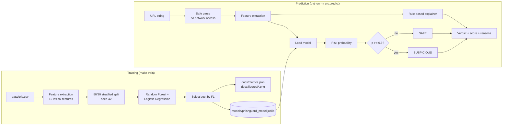

# PhishGuard Architecture

PhishGuard has two flows: an offline **training** flow and an online **prediction** flow.
Neither flow ever connects to a URL being analysed.

```mermaid
flowchart LR
    subgraph Training["Training (make train)"]
        A[data/urls.csv] --> B[Feature extraction<br/>12 lexical features]
        B --> C[80/20 stratified split<br/>seed 42]
        C --> D[Random Forest +<br/>Logistic Regression]
        D --> E[Select best by F1]
        E --> F[(models/phishguard_model.joblib)]
        E --> G[docs/metrics.json<br/>docs/figures/*.png]
    end
    subgraph Prediction["Prediction (python -m src.predict)"]
        H[URL string] --> I[Safe parse<br/>no network access]
        I --> J[Feature extraction]
        J --> K[Load model]
        F --> K
        K --> L[Risk probability]
        L --> M{p >= 0.5?}
        M -->|yes| N[SUSPICIOUS]
        M -->|no| O[SAFE]
        J --> P[Rule-based explainer]
        N --> Q[Verdict + score + reasons]
        O --> Q
        P --> Q
    end
```
